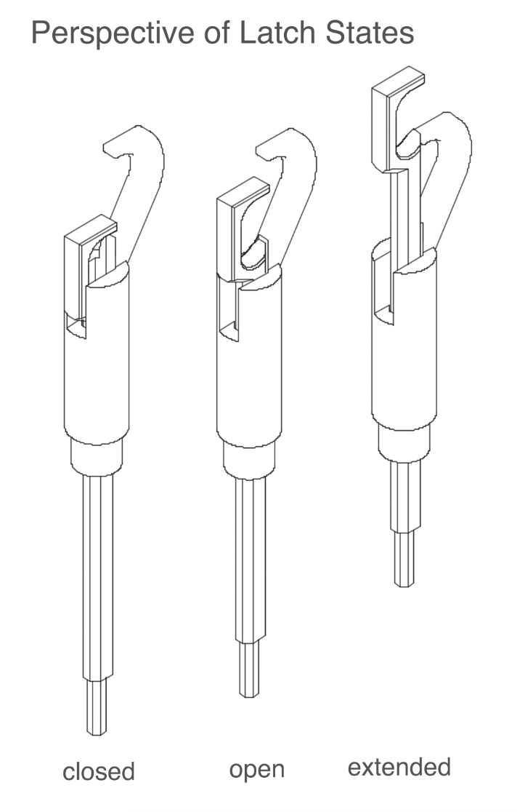

# CrochetMatic

## Overview

CrochetMatic is a personal fabrication system that crochets a coarse model of a 3D geometry.

## Development Tools

The system requires the following software tools easily and freely available on common operating systems:

1. [Arduino](https://www.arduino.cc/en/Main/Software) IDE for programming the firmware running on both the RAMPS Board and the Teensy.
2. [Fusion 360](https://www.autodesk.com/products/fusion-360/students-teachers-educators) for modelling and modifing CAD files. Note that some available legacy components were designed in [SolidWorks](https://www.solidworks.com/) which is only available on windows computers and requires a license. The documentation includes a pointer to the Google Cloud directory in which the .stl, .dxf, and .pdf files that are needed for fabrication are hosted.
3. [Repetier Host](https://www.repetier.com/) for communicating with the RAMPS board through G-Code instructions and executing the generated commands for knitting.

## Hardware

#### X/Y Bed

Movement of the platform holding the needle array is done using two motors mounted to a T-Slot frame. The motors are set up in a CoreXY set up, which is a slightly less straightforward set up for driving movement in the XY plane. The main distinction being that acuation of either motor individually results in the platform's movement in both the x and y axis. This [video](https://www.youtube.com/watch?v=8WLZ8OesMF4) explains the kinematics of the CoreXY setup. While this is useful to understand and a good place to begin debugging if the system is to fail - the X/Y will likely require the least modification. Moreover, **be careful not to accidentally remove or move the platform on which the needle array is mounted** as it's position effects the calculations for the bed movement.

The range of motion of the machine in terms of G-Code coordinates is from (0,0) to (460, 460) which are the back-left and front-right of the frame when facing the needle array.

Before the platform can be controlled it must be homed using the G28 command or by pressing the Home All button on Repetier Host. Once homed, the position of the platform can be controlled using the following command:

    G1 X<x_coordinate> Y<y_coordinate>

For example, entering `G1 X100 Y320` moves the bed to (100, 320).

The system can also have it's absolute zero position set to a specific value using the `G91` or `G92` commands, however, we generally avoid doing so when controlling motion along the X/Y axis. Note, we do use `G92` for resetting the extruder value, however, this does not change the absolute zero for the platform.

#### Arduino Mega & RAMPS Shield

The system uses the RepRap G-Code spec and as such requires a shield for the Arduino Development Board to interface with the devices used in the system (X/Y axis motors, yarn extruder, cast-on tool etc.). Our system uses an Arduino Mega with a RepRap Arduino Mega Polulu Shield (RAMPS) 1.4 and a modified version of the Repetier Firmware. The updated firmware is included in the GitHub repo for the project.

Since the system uses a shield primarily for controlling 3D printers, there are some additional steps needed before the yarn extruder functions properly. The board has two resisters and a potentiometer attached where the heat sensors are supposed to be in order to simulate the behavior of a heating element (which we do not have) such that the extruder properly extrudes yarn. If at any point the yarn extruder refuses to move, check the Temperature Curve tab on Repetier Host. **If there’s no red line appearing on that tab or the red line is at a very high temperature, there’s something wrong with the resistor and potentiometer.**

_RAMPS 1.4 Schematic_

#### Yarn Extruder

The yarn extruder is comprised of a stepper motor driving two gears which pinch the yarn forward through a 3D printed pipe attachment. The attachment serves to guide the yarn down to where it is manipulated by the needle array. If the pipe is ever replaced, the inside **must** be sanded down, otherwise the yarn will get caught inside the tube and kink. In which case it will not be moving down smoothly toward the needle array.

#### Needle Array

The current iteration of the system has a 5x5 array of needles, which are organized into 5 blades, each holding 5 needles.

##### Motors

Each needle is identical in function and design, however, in order to compact the design the orientation of the motors is flipped for successive motors (horizontally) along the blades. This is highlighted in the drawing and diagrams for the needle blades, and is handled in the firmware (the Needle Class has an `bool inverted;` member variable to account for this).

Each needle uses two servos to manipulate the height of a hook and latch which each move along the same axis. The motors are [SG90 9G (TowerPro)](https://www.amazon.com/dp/B072V529YD/ref=sspa_dk_detail_3?pd_rd_i=B072V529YD&pd_rd_w=yyZIJ&pf_rd_p=8a8f3917-7900-4ce8-ad90-adf0d53c0985&pd_rd_wg=Z4xUF&pf_rd_r=4DE64EA60DG7TMVZPVC7&pd_rd_r=7d002c4e-9a38-11e9-aa23-c7cae6a5aa84&th=1) Servo Motors. These servos are used primarily because they are quite affordable, however, this also means they are generally more unreliable than higher end servo motors. As such, each servo must be calibrated before the system can be used; instructions for how to calibrate the servos are in the [Calibration](#Calibration) subsection.

##### Needle Blade & Rail Design

Each needle is comprised of two principle parts: the hook and latch. The hook is used primarily for grabbing and manipulating the yarn from the extruder. The latch is used for holding the yarn in place and creating loops by pushing the yarn over itself. The hook and latch on each needle can move independently, however to simplify the instructions for creating the different kinds of knits, the latch can only assume three positions relative to the position of the needle.

The latch positions are: closed, open, and extended.

The positions of both the hook and latch are adjusted by translating the servo motor's rotational motion to vertical motion through a rack and pinion mechanism.

The construction of the entire needle assembly is relatively straightforward, however, some pain points can be avoided by keeping the following in mind.

1. Ensure that the servo is as close to planar with the laser cut rack as possible. This is done by securely fastening the motor to the support structure. It isn't neccesary that the bottom side of the motor is screwed onto the support structure. In some cases, it is actually better to avoid screwing in the bottom. This is due to the fact that the servo's inner gear doesn't allow for the driving gear to be attached flat onto the servo, instead, it is at a slight angle. In these cases, the gear can strike the support structure while rotating, and if both sides of the motor bracket are secured to the structure, this clash will cause the servo to stall. To avoid this when it arises, don't screw the bottom of the mount and instead allow for some room between the gear and the support structure. This only emerges because of the low cost servos we use, and could possibly be entirely solved by printing slightly thinner gears, as it is still rare for this problem to emerge.

2. The upper shaft collar is printed in an orientation to avoid any supports in printing. However, this means that attaching the set screw can lead to too much stress on the collar and the print can flex/break. It is very important to the system that the outer tube is securely attached to the shaft collar and laser cut rack assembly. As such, when attaching the set screw, tighten it slowly and be mindful that this part can easily break, and could require replacement.

3. In our design, the hook and latch are attached to the upper and lower tubes using only a friction fit. However, due to some variance in the 3d printing process, these friction fits aren't all equally secure. As such, we use hot glue for the latch/inner tube interface and tape for the hook/outer tube interface to ensure neither moves during use.

4. It's important that the outer tube rests at the exact same spot on the upper shaft on each needle assembly. To do this, we ensure that the bottom of the outer tube is sitting on the m2 screw used to secure the laser cut rack to the upper shaft collar.

5. Ensure that the servos are all full extended before mounting them onto the structure and loading the racks. This is slightly difficult to explain in words, but you do not want to slide the racks in and notice that the servo isn't at it's full range. To solve this, rotate the servo to it's opposite extreme beofre attaching the rack. This will save you lots of disassembly/assembly.

The system only ever has a single needle active - with the remaining servos powered off. As such we can use as many blades to construct an array on which to knit upon. To do this, we build single blades of needles and then add blades to the platform to construct the needle array. Currently, a single blade is made up of 5 needle and the system uses 5 blades for to make a 5x5 needle array for printing.

#### Construction

Construction instructions follow logically from the CAD folder containing all the designs for components. Most parts, individually don't take more than 45 minutes to print, and perform well with the prusa default settings. Most also don't require support if oriented properly on the build platform. Some exceptions include the motor brackets which can benefit from supports and also take longer to print, and specialized parts such as the extrude attachment. The hook can also benefit from some supports, however, it's only required to have these from the build plate.

The optimal order for constructing a single blade is the following:

1. Assemble the laser cut structure. This is the columns and beams that attach at a T-slot joint.

2. Construct each servo mount individually. Remember to secure the gears using washers.

3. Assemble all the shaft collar/rack pairs.

4. Attach the hook and latch to the outer and inner tubes respectively using the shaft collars previously assembled.

5. Mount the servos to the support structures, only securing the tops of the brackets.

6. Insert the needles into the slots and slide the two racks into place. Check for the servo's range of movement here.

7. Tighten supports and fix the bottom of the servo motor mounts where it is safe to do so.

8. Organize wires to move through the holes on one of the laser cut columns so that there is no catching between the gear and rack as they move.

## Firmware

#### Needle Control

The needles can be controlled through the serial monitor. N[i] selects the ith needle for control. For example N1 selects the 1st needle. To move the hook on the needle up you can use `W` or `w`. The upper case `W` moves the hook up by a large increment and the lower case `w` moves the hook up by a small increment. The upper case `Z` and `z` do the same operation in inverse, moving the hook down. The controls for the latch are similar but leverage different keys: `R` and `r` for moving the latch up. `C` and `c` for moving the latch down.

To move the needle assembly up and down programmatically you can also use Z[i] to move the hook and latch to a position along the Z axis. To move the latch to it's different states you can use E<{-1, 0, 1}> where -1 corresponds to the closed latch state, 0 to the open state, and 1 to the extended state. These states will be reached relative to the Z position automatically.

#### Calibration

Calibrating the needles requires calibrating the latch and needle pulse widths as well as calibrating the home position.

##### Calibrating Pulse Width

Since the machine uses hobby servos, there is a significant amount of variablity in the range of motion between servos. In order to ensure that the lowest and highest positions for the machine are constant we need to account for this variability when computing the amount each needle should move. To do this you will need the hook and latch calibration tools (flat disks with a white top and collars to attach to the respective needle components) and a rangefinder attached to the top beam of the machine. The rangefinder will measure the distance between the top beam and the calibration tools attached to the needle components (hook & latch).

The next step to the calibration is establishing a minimum and maximum height for each needle component. This will then allow you to establish which pulses correspond to a height that you will hold constant across all needle components. Determining this height may require some familiarization with the range of motion of each servo. To determine these heights: set all the servos driving the component to their lowest position & find the highest position. This is your common minimum height for a needle component, you should measure how far it is from the top beam using the rangefinder. To determine the maximum height of a component, move each servo to it's highest position and select the lowest of these positions as your constance maximum height for the component. Repeat this for the other components.

Next, you need to determine the servo position that corresponds to the minimum and maximum heights. This must be done individually for each needle hook and latch. To do this you must:

1. Attach the calibration tool to the needle component you are calibrating
2. Move the needle under the rangefinder.
3. Using the serial monitor to enter commands, move the needle component down until the distance from the calibration tool is the minimum height you measured earlier.
4. Record this position and enter it in the needle parameters table in the `Needles_Firmware.ino` file on L224. The values in this table map to <`pin number`, `min_position`, `max_position`> Note: this position may be large (close to 2500) or small (close to 500). This is alright, the minimum height in terms of servo position changes based on the orientation of the servo. Knowledge about which servo is inverted is in the inversion table in `Needles_Firmware.ino`.
5. Use the Serial Monitor to move the needle component up until the rangefinder reads the maximum height you determined for the component earlier.
6. Record the servo position that corresponds to this height and record it in the needle_parameters table in `Needles_Firmare.ino`.

Repeat these steps for each needle component. It will take some time.

##### Calibrating Home Positions

To ensure that the knit commands are the same for each needle in the machine, we establish a reference home position relative to which each knit is defined. This home position must be set for each needle. To do this you will need the home position calibration tool, which attaches to the extrusion tool, extending it to the height at which the needle picks up the yarn. The calibration tool has a groove in which the needle will rest when it's at it's home position. Use repetier until the needle is resting inside the groove. This is it's home position. Record it in the `home_positions.json` file. Repeat this for every needle on the machine. This will also take some time, luckily it's quite a bit shorter than calibrating the servos.

##### Calibrating Tool Positions

Another step you will need to take if a tool is ever moved or changed is recalibrating the tool positions. To do this, use repetier to measure the relative position of each tool from the extruder and record these relative measurements in the `tool_positions.json` file.

## Defining Knits

### Knit Types

#### Casts

##### Cast On

The cast on is meant to attach a starting loop onto a needle. This leverages the pinching transfer needle to complete the operation. The cast on is a combination of a circular move, a backwards brush, a pinch grab, and a forwards brush. The operation loops some yarn around the needle and uses the backwards brush to secure the yarn in the closed position. Next the yarn is pinched into the transfer needle and the hook grabs yarn from the pinched transfer. Next the latch is raised above the hook so the looped yarn is in position to be pushed over the yarn on the hook. The forward brush moves the loop over the yarn on the hook and pushes the now closed, casted loop into the latch.

##### Cast Off

The cast off moves a loop of yarn off it's current needle and onto an adjacent needle. This is done by leveraging the transfer needle: raising the existing loop onto the transfer needle and using the hook of another needle to move under the transfer needle and retrieve the hanging loop and closing the loop currently on said retrieving needle using this new hanging loop. 

#### Brush Maneuvers

##### Forward Brush

The forwards brush is meant to push the existing yarn on the latch over the hook. This is done by extending the latch and moving through the brushes.

##### Backwards Brush

The backwards brush is meant to push down the loop into the latch and then close the latch to keep the new yarn secure. 

#### Directional Loops

In order to keep the yarn from kinking and greating points of high tension, the way a loop is formed is different based on which direction it's being created from. i.e. if the last loop lies to the right of the needle on which the new loop should be create on, then you must use a rightward loop since the direction of the yarn is moving towards the right. Inverting the aforementioned condition is what results in the leftwards loop. 

##### Leftward Regular Loop and Rightward Regular Loop

Both these loops just distinguish the direction with which the circular movement is performed such that the formed loop doesn't have a kink, but rather is loose and capable of being stretched and extended easily. 

#### Wrap Loop

In instances where the direction of the new loop being formed isn't leftwards or rightwards (for instance when moving between rows) you must used a wrap loop. The wrap loop will have more tension as it has a point in which the yarn passes over itself. The wrap loop should be the start of a rightwards or leftwards pattern, and each sequence of loops ought to be planned such that the number of wrap loops is minimized. 

#### Pinch Grab

The pinch grab is a useful maneuver that hold a section of the yarn taught and in position to be grabbed by a hook. It does this by moving a swinging arm under the extruder and trapping it against the transfer needle. The downside of this maneuver is that the swinging arm needs to move back around to being behind the extruder after the maneuver is complete. This means the entire needle rack assembly needs to drag the yarn far from the extruder so the swinging arm doesn't catch the yarn on it's sweep back. All this could be avoided if we use a stepper with an endstop to move the swinging arm instead of using a servo motor. 

